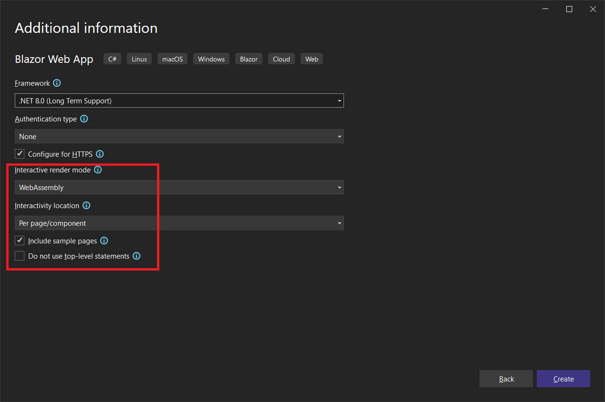

# GrpcStateServiceProvider

`GrpcStateServiceProvider` fixes a problem with .NET 8 Blazor Web Apps where scoped services are repeatedly created and destroyed, making state persistence impossible. 

It supports .NET 8 Blazor Web Apps with the interactivity location is set to **per page/component**. It will work with the Interactive Render Mode set to **Server**, **WebAssembly**, or **Auto**. The configuration for each of these will be slightly different.

If you are using the **Global** interactivity location, you do not need this library.

This package must be installed on both the client and the server project.

## How does it work?

In order to maintain state, there must be a persistent cache of values located somewhere safe, that will not change throughout the lifecycle of the application.

On the server side in the `GrpcStateServiceProvider` project, there is a dictionary in a static class called `ServerSideStateBag` that keeps a byte array representing a state object for every user, which is identified by a unique GUID, or ID string:

```C#
public static class ServerSideStateBag
{
    public static Dictionary<string, byte[]> State = new Dictionary<string, byte[]>();
}
```

The string is generated on the client, in a class that will be the base class for the Blazor component used in the client app. This is the `AppStateProviderBase` class in the `GrpcStateClient` project, a Razor Class Library.

This assembly has embedded JavaScript code that will save and load cookies:

```javascript
function setCookie(name, value, days) {
    var expires = "";
    if (days) {
        var date = new Date();
        date.setTime(date.getTime() + (days * 24 * 60 * 60 * 1000));
        expires = "; expires=" + date.toUTCString();
    }
    document.cookie = name + "=" + (value || "") + expires + "; path=/";
}

function getCookie(name) {
    var nameEQ = name + "=";
    var ca = document.cookie.split(';');
    for (var i = 0; i < ca.length; i++) {
        var c = ca[i];
        while (c.charAt(0) === ' ') c = c.substring(1, c.length);
        if (c.indexOf(nameEQ) === 0) return c.substring(nameEQ.length, c.length);
    }
    return null;
}
```

When the `AppStateProviderBase` class is initialized and rendered, it will look for a cookie called **stateBagId**, which will return a GUID like **4C084A45-ED2C-4990-8BE6-8E32616C2137**, a value that is unique in the world. This identifies the user.

The `AppStateProviderBase` class communicates with the `AppStateTransportService` class via gRPC, ensuring fast and efficient transport between client and server.

In your Blazor Web App you will create an interface called `IAppState` and an implementation class called `AppState`. Actually, it doesn't matter what you call them, but you do need an interface and an implementation.

In this demo they look like this:

*IAppState.cs*

```c#
public interface IAppState
{
    string Message { get; set; }
    int Count { get; set; }
}
```

*AppState.cs*:

```c#
public class AppState : IAppState
{
    public string Message { get; set; } = string.Empty;
    public int Count { get; set; }
}
```

Then you create a new Razor Component that inherits from `AppStateProviderBase<AppState>`. Of course, you would substitute `AppState` for whatever your state class is called.

Your implementation is simple. It looks like this:

```c#
@inherits AppStateProviderBase<AppState>
@implements IAppState

@ChildContent

@code {

    [Parameter]
    public RenderFragment ChildContent { get; set; }

    public string Message
    {
        get => (string)GetPropertyValue<string>();
        set => SetPropertyValue(value);
    }

    public int Counter
    {
        get => (int)GetPropertyValue<int>();
        set => SetPropertyValue(value);
    }
}
```

You must inherit from `AppStateProviderBase<T>` and you must implement your state interface. In this case it is `IAppState`.

Your property handlers must look like the above example. This allows the base class to do all the work of syncing values on the server and notifying other instances of your `AppStateProvider` component when values change.

On the client, the `NotificationService<T>` class (in the `StateNotificationLibrary`) is a singleton that serves two purposes. It keeps a single instance of your `AppState` class and it also notifies any other components when one component mutates the state. 

It provides `GetProperty` and `SetProperty` methods that are used by `AppStateProviderBase` to read and write property values.

The end result is a robust state management system that makes it easy for the developer to manage state without plumbing code.

## Create a Demo App

Create a new Blazor Web App using .NET 8 with the Interactivity location set to per page/component.

In this case I'm setting the interactive render mode to **WebAssembly** .



Add the following NuGet package to the the solution (both projects):

```
GrpcStateServiceProvider
```

### Server Configuration

> :point_up: If the Interactive Render Mode in your solution is set to **Server** or **Auto**, you must add both the client and server configuration in the server project's *Program.cs*, with modifications that I will mention.

To the server project, add the following packages:

```xml
<PackageReference Include="Grpc.AspNetCore" Version="2.60.0" />
<PackageReference Include="Grpc.AspNetCore.Web" Version="2.60.0" />
```

Add the following to the *Program.cs* file:

```c#
using GrpcStateServiceProvider; // Required for the AppStateTransportService
```

```c#
// Required for the AppStateTransportService
builder.Services.AddGrpc();
```

```c#
// Required for the AppStateTransportService
app.UseGrpcWeb();
// Required for the AppStateTransportService
app.MapGrpcService<AppStateTransportService>().EnableGrpcWeb();
```

### Client Configuration

To the client project, add the following packages:

```xml
<PackageReference Include="Google.Protobuf" Version="3.25.2" />
<PackageReference Include="Grpc.Net.Client" Version="2.60.0" />
<PackageReference Include="Grpc.Net.Client.Web" Version="2.60.0" />
<PackageReference Include="Grpc.Tools" Version="2.60.0">
    <PrivateAssets>all</PrivateAssets>
    <IncludeAssets>runtime; build; native; contentfiles; analyzers; buildtransitive</IncludeAssets>
</PackageReference>
```

Add the following to the client project's *Program.cs*, or if you are using **Server** or **Auto** render mode, you must also add them to the server project:

```c#
// required for accessing AppStateTransportService 
using Grpc.Net.Client.Web;
using Grpc.Net.Client;
using GrpcStateClient;
using Microsoft.AspNetCore.Components;
```

```c#
// Required for calling the AppStateTransportService via GrpcStateClient
builder.Services.AddScoped(sp => new HttpClient { BaseAddress = 
    new Uri(builder.HostEnvironment.BaseAddress) });

// Required for calling the AppStateTransportService via GrpcStateClient
builder.Services.AddSingleton(services =>
{
    var httpClient = new HttpClient(new GrpcWebHandler(GrpcWebMode.GrpcWeb, new HttpClientHandler()));
    var baseUri = services.GetRequiredService<NavigationManager>().BaseUri;
    var channel = GrpcChannel.ForAddress(baseUri, new GrpcChannelOptions { HttpClient = httpClient });
    return new AppStateTransport.AppStateTransportClient(channel);
});
```

If you are using **Server** or **Auto** render mode, when adding these lines to the server project, you must get the base address from *\Properties\launchSettings.json*. It might look something like this:

```c#
// Required for calling the AppStateTransportService via GrpcStateClient
builder.Services.AddScoped(sp => new HttpClient { BaseAddress = 
    new Uri("https://localhost:7283") });

// Required for calling the AppStateTransportService via GrpcStateClient
builder.Services.AddSingleton(services =>
{
    var httpClient = new HttpClient(new GrpcWebHandler(GrpcWebMode.GrpcWeb, new HttpClientHandler()));
    var baseUri = new Uri("https://localhost:7283") });
    var channel = GrpcChannel.ForAddress(baseUri, new GrpcChannelOptions { HttpClient = httpClient });
    return new AppStateTransport.AppStateTransportClient(channel);
});
```

When you go to deploy your app, you will change ` "https://localhost:7283"` to the URL of the production server.

To the *_Imports.razor*, add the following:

```
@using GrpcStateClient
@using StateNotificationService
```

To the client project, add the following two .cs files:

*IAppState.cs*

```c#
public interface IAppState
{
    string Message { get; set; }
    int Count { get; set; }
}
```

*AppState.cs*:

```c#
public class AppState : IAppState
{
    public string Message { get; set; } = string.Empty;
    public int Count { get; set; }
}
```

You can, of course, modify these two classes to fit your needs.

To the client project, add a new Razor component: 

*AppStateProvider.razor*

```C#
@inherits AppStateProviderBase<AppState>
@implements IAppState

@ChildContent

@code {

    [Parameter]
    public RenderFragment ChildContent { get; set; }

    public string Message
    {
        get => GetPropertyValue<string>();
        set => SetPropertyValue(value);
    }

    public int Count
    {
        get => GetPropertyValue<int>();
        set => SetPropertyValue(value);
    }
}
```

This is your custom AppState provider that understands your AppState class.

### Usage

Replace *Counter.razor* with the following:

```c#
@page "/counter"
@rendermode InteractiveWebAssembly

<PageTitle>Counter</PageTitle>

@if (!loaded)
{
    <p><em>Loading...</em></p>
}
else
{
    <AppStateProvider @ref=appState>

        <h1>Counter</h1>

        <p role="status">Current count: @appState.Count</p>

        <button class="btn btn-primary" @onclick="IncrementCount">Increment Counter</button>

        <button class="btn btn-primary" @onclick="UpdateMessage">Update Message</button>

    </AppStateProvider>
}

@code {

    bool loaded = false;

    private AppStateProvider appState { get; set; }

    private void IncrementCount()
    {
        appState.Count++;
    }

    private void UpdateMessage()
    {
        appState.Message = $"Hello from Counter at {DateTime.Now.ToLongTimeString()}";
    }

    protected override async Task OnAfterRenderAsync(bool firstRender)
    {
        if (firstRender)
        {
            loaded = true;
            StateHasChanged();
        }
    }
}
```

Run the app, and go to the Counter page. Increment the counter, go to the Home page, and back to the Counter page. The current count will be maintained.

### Notification Demo

This exercise will show off the notification feature, where each AppStateProvider will be notified when an AppState property changes.

To the client project, add the following Razor component:

*Toolbar.razor*:

```c#
@rendermode InteractiveWebAssembly

@if (loaded)
{
    <AppStateProvider @ref=appState>
        @appState.Message
    </AppStateProvider>
}

@code {

    bool loaded = false;
    private AppStateProvider appState { get; set; }

    protected override void OnAfterRender(bool firstRender)
    {
        if (firstRender)
        {
            loaded = true;
            StateHasChanged();
        }
    }
}
```

Modify *MainLayout.razor* to show the Toolbar:

```html
@inherits LayoutComponentBase

<div class="page">
    <div class="sidebar">
        <NavMenu />
    </div>

    <main>
        <div class="top-row px-4">
            <Toolbar />
        </div>

        <article class="content px-4">
            @Body
        </article>
    </main>
</div>

<div id="blazor-error-ui">
    An unhandled error has occurred.
    <a href="" class="reload">Reload</a>
    <a class="dismiss">🗙</a>
</div>
```

Run the app, navigate to the Counter page, and click the **Update Message** button. The message will show in the Toolbar.

